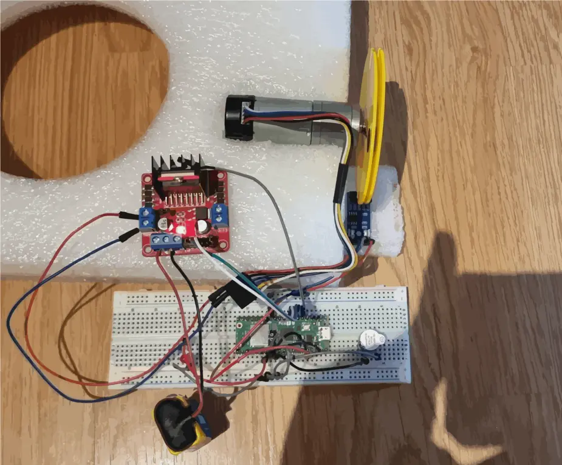
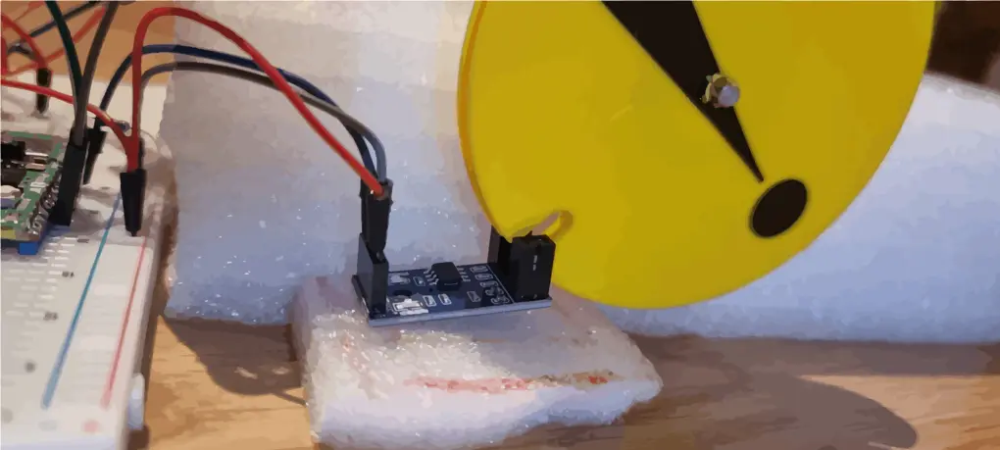
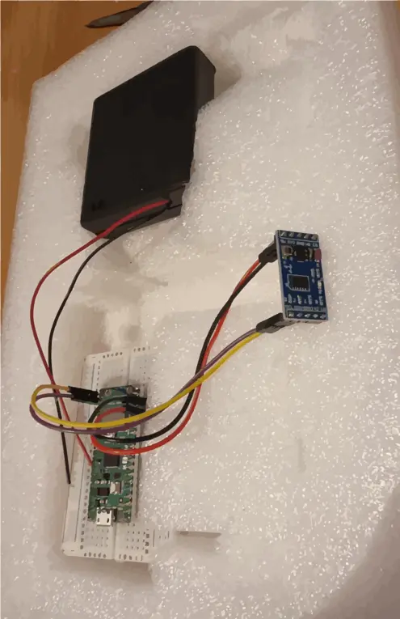
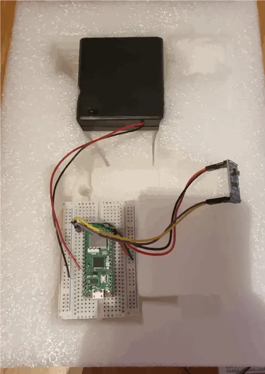

# Rust-Based Smart Fishing Rod

An automated fishing rod system with motion detection and automatic reeling.

:::info 

**Author**: Buzbuchi Matheo \
**GitHub Project Link**: https://github.com/UPB-PMRust-Students/proiect-MBuzbuchi.git

:::

## Description

The main purpose of this project is to implement an automated fishing rod controlled by a microcontroller. To achieve this, the system follows several key steps:

1. Fish presence detection near the bait:
An accelerometer sensor is placed inside the bobber, acting like a motion detector or "proximity radar" to sense movement near the hook. When such motion is detected, a red LED on the fishing rod is activated to alert the fisherman that fish are in the critical area and to stay alert.

2. Bite detection and audible alert:
This is the most complex part of the automation process, as it typically relies on the skill of the fisherman to detect when a fish has actually taken the bait without snapping the line.
From experienced fishermen (30–40 years of practice), I’ve learned that a fish doesn’t always pierce its lip fully when it bites—so an automatic pulling mechanism shouldn’t start immediately.
To address this, a force sensor is placed along the fishing line to measure tension changes. When a noticeable tension change is detected (indicating a bite), a buzzer is activated to alert the user.

3. Rod type configuration and auto-reeling:
The system includes three buttons, each representing a different type of fishing rod or line configuration. The user selects the current setup, and the parameters (such as pulling force and timing) are adjusted accordingly in the code for accurate reeling.
After the fish takes the bait and the fisherman ensures the hook is properly set, a 3-second delay begins. Once that delay passes, the servomotor is triggered and begins the automated reeling process, simulating the action of turning the reel handle.

## Motivation

The inspiration for this project came from real-life experiences in my neighborhood, where many of my apartment neighbors are passionate about fishing. One day, I overheard a neighbor’s child complaining about how exhausting and difficult it was to catch fish—mentioning that his arms got tired and it was hard to know exactly when the fish was hooked, especially when dealing with a larger catch.

This sparked the idea of taking on the challenge of automating a process that is inherently physical and skill-based. I wanted to create a system that could assist fishermen especially beginners or children by reducing the physical effort and improving bite detection accuracy.

Additionally, I was inspired by one of Michael Reeves videos that I saw during high school, which made me consider if I was able to reproduce something similar but conducted in a more purpose-driven and cohesive matter.

## Architecture 

The following diagram shows the logical architecture of the automated fishing rod system. It includes the main components and how they interact with each other through control and feedback loops.

The system is composed of the following architectural blocks:
1. **Fish detection** — Bobber detects motion and triggers a red LED alert.
2. **Bite detection** — Force Sensor (FSR) detects a tension spike and activates the buzzer.
3. **Rod configuration & reeling** — User selects rod type via buttons; a 3-second delay logic then triggers the servo motor.
4. **Reset** — Once the reeling completes, the system resets and awaits new fish motion input.

Below is the architecture diagram:

## Log

<!-- write your progress here every week -->

### Week 5 - 11 May

This week, I began approaching the core of the project by collecting relevant information that could help me find a reliable way to automate the fishing process. To complement online research—which often provided ambiguous or incomplete insights—I consulted a local experienced fisherman to validate my understanding of the practical aspects involved.

From our discussions, I learned that different types of fishing lines are used depending on the context, and that even though the hook typically attaches to the fish quite easily, the fisherman must actively ensure the hook pierces through the fish’s lip before starting the reeling process. One of the most challenging aspects in automating this behavior is replicating the fisherman’s instinct: reeling too early or simultaneously with the fish's resistance might cause the line to twist or, in the worst case, snap entirely.

In parallel with this research, I also analyzed related projects and documentation, which helped refine and validate my proposed system architecture.

One of the most difficult tasks was figuring out how to reliably detect the moment a fish bites the bait. Initially, I considered using force-sensitive resistors (FSRs) placed near the rod's string. However, I discovered that FSRs primarily detect vertical pressure, not horizontal tension. I explored mounting the sensor at the rod tip, but that idea proved problematic due to humidity or water drops that could eventually damage the sensor or surrounding components.

Another idea was to mount the sensor near the reel (mulinetă), with two metal bars from a luggage frame enclosing the string. The FSR would be placed so that, when the fish pulls, the tension in the string would press against the sensor. Unfortunately, this again involved horizontal force rather than vertical pressure, so reliability remained an issue.

Looking for inspiration, I came across a Microsoft research project where they tackled a similar problem. Their solution involved a complex chamber and conductor system that isolated vertical force components—too sophisticated to reproduce in just three weeks.

After discussing the challenge with a neighbor who repairs cars, I learned about safety sensors in car windows—specifically limiters that stop the window when an obstruction is detected (like a hand). Inspired by this, I considered adapting a similar mechanism for the rod: when the string lifts due to a fish pull, it could be detected by a sensor positioned just beneath the default rest point.

While this research consumed a significant amount of time, I also began acquiring the actual components for the build, intending to refine the detection mechanism while the parts arrived. After iterating on several concepts, I reached an overall perspective on the system structure and clarified how the main modules—sensors, motor, and controllers could interact.

These efforts marked a key milestone in the planning phase and prepared me to confidently move into prototyping next week.

### Week 12 - 18 May
For the current weekend came the transition from documentation to implementation, as I moved from conceptual design to breadboard prototyping.

I began by designing a full schematic in KiCAD before assembling components on the breadboard. This schematic helped me determine the types of connectors and spacing requirements, streamlining the hardware integration phase. I successfully wired both Raspberry Pi Pico W boards, ensuring connections for sensors, actuators, and the motor driver.

A major challenge was the delayed arrival of essential components, which put pressure on the woarkload I had to acchieve by the end of the week. However, with support from my lab assistant, we managed to agree on the fish biting detection component so that it was more efficient to focus on the core mechanism rather than immediately pursuing a polished case or enclosure.

Another take/idea (which is also what I've agreed on using for the hardware part), we explored was integrating an optical detection system using the ITR9608-F sensor and a rotating disk (pseudo-mulinet). Initially, I considered placing the sensor at the tip of the disk so that the fish's pull would block the IR beam (initially it is placed in the exposed slit made on the disk). But this proved unreliable—waves could falsely trigger detection. We concluded that the sensor should be positioned at a deeper angle (at least >25 grade inside the reel structure from the slit) so that only an intentional pull from a fish allows the slit on the rotating disk to align and pass the IR beam.

Much of the weekend was dedicated to constructing this precision mechanism. The rotating disk was made from two thin plastic pieces with an embedded sink gasket acting as a soft coupling. I crafted a polystyrene enclosure to elevate the motor—ensuring the reeling action wouldn't collide with the breadboard or other components. This positioning also kept the sensor safe while maintaining compactness.

For the bobber module, I mounted the ADXL343 accelerometer along with its corresponding Pico onto a carved polystyrene block for protection and waterproofing simulation.

Major technical milestones this week include:

Integrated the ITR9608-F optical sensor in a pull-up configuration, correctly routing VCC and GND. I validated its behavior using a slit disk to simulate a fish bite.

Wired the ADXL343 accelerometer to the secondary Pico via I2C (GPIO0/GPIO1). This module will later detect nearby fish movement via motion sensing.

Powered the L298N motor driver and conected it to the dc motor, making sure that in1 and in2 are used in order for the reel to pull.

Resolved GND referencing issues by connecting a unified ground rail across all modules, ensuring signal consistency.

Updated and committed the KiCAD schematic to the GitHub repository, and added some refrence picture of the progress regarding the project this week.

### Week 19 - 25 May

## Hardware

The following hardware components were used to build the automated fishing rod system:

- `Raspberry Pi Pico 2 WH (RP2350)` — Acts as the main microcontroller, Reading fish bite detection via the ITR9608-F optical sensor which verifies if the corresponding infrared beam emited by the sensor
                                      can pass trough some small gaps of the wheel which spins acording to the fish strength to pull the string (normally the sensor light cannot pass trough the circle
                                      after a certain treshold the light passes trough the gaps).
- `Raspberry Pi Pico 2 WH (RP2350)` — Acts as the secondary microcontroller, to monitor fish activity in the proximity of the bobber.
- `ADXL345 Accelerometer` — Embedded inside the fishing bobber to detect nearby fish motion through water vibrations.
- `ITR9608 Senzor Fotoelectric Infrarosu` — An IR reflective optical sensor used to detect interruptions (like a rotating slit disk).
- `Red LED` — Provides a visual alert when motion is detected near the hook.
- `Buzzer` — Gives an audible signal when a fish bite is detected via the ITR.
- `L298N H-Bridge driver` - Driver used by the motor in order to process rotation direction and speed.
- `DC Motor` — Handles the automatic reeling of the fishing line after bite confirmation and user reaction.
- `Rezistor` - Used either to set high logical level, protect diodes by limiting the current and manage the current that reaches certain components (Buzzer).

Up next here are presented some pictures with the hardware.

Top View of the Main PICO used to reel in and signal the fisherman about different states of the fishing process:

Side View of the optical sensor which is supposed to measure if the ray can pass through the disk in order to detect the fish who took the bait:

Side View of the second pico which is supposed to give the proximity data of the fish to the main MCU:  

Top view of the second pico:  

 
### Schematics

Here is presented the KiCAD Schematic:

### Bill of Materials

| Device | Usage | Price |
|--------|--------|-------|
| [Raspberry Pi Pico 2WH](https://www.raspberrypi.com/documentation/microcontrollers/raspberry-pi-pico.html) | The microcontroller | [25 RON](https://shop.pimoroni.com/products/raspberry-pi-pico-2?variant=54906879213947) |
| [MPU6050 Accelerometer](https://invensense.tdk.com/products/motion-tracking/6-axis/mpu-6050/) | Detects water motion in the bobber | [15 RON](https://www.optimusdigital.ro/ro/senzori-senzori-inertiali/96-modul-senzor-triaxial-mpu-6050.html) |
| [Force-Sensitive Resistor (FSR402)](https://www.interlinkelectronics.com/fsr-402) | Detects tension in the fishing line (bite) | [42 USD](https://www.amazon.de/-/en/Hilitand-Sensor-Resistor-Resistance-Pressure/dp/B07DB37NZM/ref=sr_1_2?dib=eyJ2IjoiMSJ9.r0nSeYQP_vZUrNxHDsyeVQU18dEKFzRuRTS_-cK6TlFo5YW6HCaRT534so0aeIUyO6bMUT5UkMIZhsnP7fjeMxhQB_RLdFrpzGOeelR8naNn1Lk1gQ3Zigw2WW7NQT9TIIlDJRSzqnIdlaHSRTAL2LYULfX4Pqbs4qjhjW52fe--V4f7kn9Ytlsamq1PgB3FE1JnOBI7E2VhPA6LfCy8OjsiivfvtEW36HtCtkQ4cys-TDI8p-8q0lZ1sMORJm2K4x55GUGn0g3a7Q5dbiMsO2unWyuLc3CA-5juhwQSkRg.Th201lA7X6yXwExxFrPurDG6Gi0_ugtGd2EmJkT-B34&dib_tag=se&keywords=fsr+402&qid=1746314137&sr=8-2) |
| [Red LED 5mm](https://www.sparkfun.com/products/9590) | Visual alert when fish are nearby | [40 RON](https://www.optimusdigital.ro/ro/kituri/11970-set-led-uri-asortate-plusivo-500-buc-led-uri-100-buc-rezistoare-i-pcb-bonus.html?search_query=led+rosu&results=166) |
| [Piezo Buzzer Module](https://components101.com/misc/buzzer-pinout-working-datasheet) | Audible alert on fish bite | [1.40 RON](https://www.optimusdigital.ro/en/buzzers/634-5v-passive-buzzer.html?search_query=buzzer&results=87) |
| [Push Buttons (12x12mm)](https://www.ckswitches.com/products/switches/product-details/Tactile/PTC125SM15SMTR2LFS/) | Rod type selection by user | [1 RON](https://www.optimusdigital.ro/ro/butoane-i-comutatoare/1119-buton-6x6x6.html?search_query=butoane&results=190) |
| [SG90 Servo Motor](https://www.ee.ic.ac.uk/pcheung/teaching/DE1_EE/stores/sg90_datasheet.pdf) | Automatically reels in the fishing line | [39 RON](https://www.optimusdigital.ro/ro/motoare-servomotoare/1161-servomotor-cu-rotaie-continua-ds04-nfc.html) |
| [Breadboard 830 Tie-Point](https://components101.com/misc/breadboard-connections-uses-guide) | Used for prototyping and connecting components without soldering | [35 RON](https://www.emag.ro/breadboard-4-in-1-700-puncte-diy-kit-ai2095/pd/DY0MN6YBM/) |
| [Jumper Wire Set (Male-Male)](https://ro.mouser.com/datasheet/2/58/BPS-DAT-(KIT-ZWx4)-Datasheet-1282851.pdf) | Connects components on breadboard and to microcontroller | [16 RON](https://ro.mouser.com/ProductDetail/Soldered/100865?qs=%252BXxaIXUDbq1ke%2FsmXT%2FkCA%3D%3D) |
| [USB Powerbank 5V](https://www.emag.ro/power-bank-5000-mah-powerneed-18-5wh-cu-panou-solar-1-w-usb-5-v-1a-5v-2a-negru-dj6dkqbbm-11257/pd/D6H81CBBM/?#specification-section) | Portable power supply via USB for Raspberry Pi Pico | ~ [70 RON](https://www.emag.ro/power-bank-5000-mah-powerneed-18-5wh-cu-panou-solar-1-w-usb-5-v-1a-5v-2a-negru-dj6dkqbbm-11257/pd/D6H81CBBM/) |

## Software

| Library | Description | Usage |
|---------|-------------|-------|
| [embedded-hal](https://github.com/rust-embedded/embedded-hal) | Hardware Abstraction Layer for embedded platforms | Provides common interfaces for GPIO, I2C, SPI etc. |
| [embassy-rp](https://github.com/embassy-rs/embassy) | HAL implementation for the RP2040 | Controls the Raspberry Pi Pico WH hardware |
| [embassy-executor](https://github.com/embassy-rs/embassy) | Embedded async executor with interrupt/timer support | Manages async/await logic for embedded applications |
| [embassy-time](https://github.com/embassy-rs/embassy) | Timing and delay functionality | Used for timers and delays in embedded code |
| [embassy-net](https://github.com/embassy-rs/embassy) | Async networking stack | Used for Wi-Fi communication (if used) |
| [embassy-gpio](https://github.com/embassy-rs/embassy) | GPIO control abstraction | Manages input/output pins and device triggers |
| [embassy-usb](https://github.com/embassy-rs/embassy) | USB device stack | USB communication management |
| [embassy-pwm](https://github.com/embassy-rs/embassy) | PWM driver support | Controls servos or dimmable LEDs |
| [embassy-pio](https://github.com/embassy-rs/embassy) | Access to RP2040 PIO block | For advanced I/O operations like serial protocols |
| [static_cell](https://github.com/embassy-rs/embassy) | Static memory allocation at runtime | Required for async resource management |
| [mpu6050](https://github.com/almindor/mpu6050) | MPU6050 accelerometer driver | Reads accelerometer data from the bobber |
| [defmt](https://github.com/knurling-rs/defmt) | Logging and debugging tool | Used for serial debug output in embedded Rust |

## Links

1. [DIY Automated Fishing Rod using Arduino and Servo](https://blog.arduino.cc/2019/12/05/an-arduino-powered-fishing-pole-with-automatic-casting-and-reeling/) 
2. [High-Sensitivity Wi-Fi Fish Bite Alarm with NodeMCU (Hackster.io)](https://www.hackster.io/andriy-baranov/high-sensitive-wifi-fish-bite-alarm-with-nodemcu-esp8266-df161c#:~:text=In%20turn%2C%20the%20controller%20analyzes,that%20there%20is%20a%20bite) 
3. [Smart Arduino Ice Fishing Rod (GitHub - gumslone)](https://github.com/gumslone/smart-arduino-ice-fishing-rod-for-winterfishing)
4. [Electric Arduino Fishing](https://www.reddit.com/r/ArduinoProjects/comments/1e9dcsi/electric_arduino_fishing/#:~:text=Plane)
5. [Gas Powered Fishing Pole](https://www.youtube.com/watch?v=KPQcy0dylrM&t)
6. [Device attached to the rod used for bite detection](https://maxoffsky.com/code-blog/dynatac-a-smart-fishing-accessory/)
7. [Arduino Forum for adaptive fishing rod](https://forum.arduino.cc/t/adaptive-fishing-rod/1347714)
8. [Flexible Sensor to detect the string of a rod beeing displaced](https://patents.google.com/patent/US20050193616A1/en)
...

